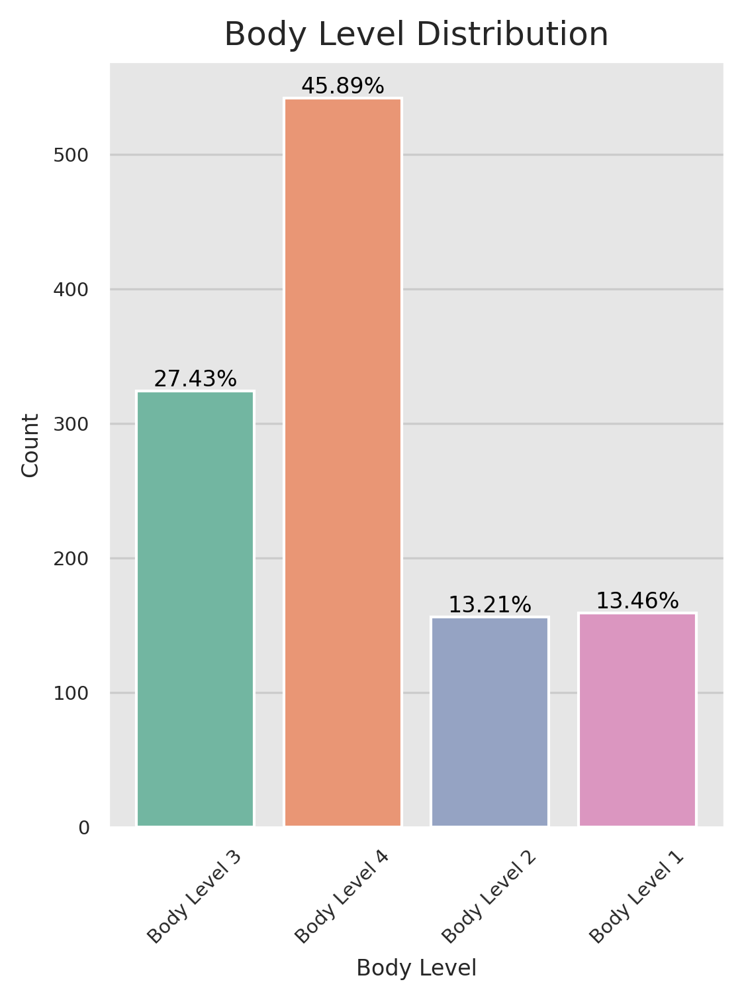
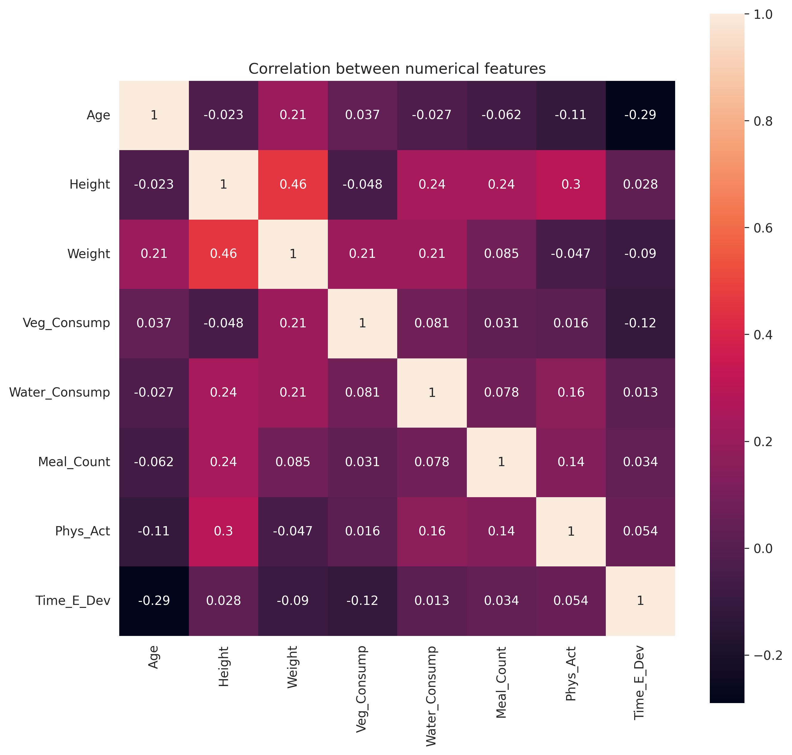

# Body Level Classification

## Problem and Dataset Description

We are solving a classification problem for human body level based on some given attributes related to the physical, genetic and habitual conditions. The given attributes are both categorical and continuous. The human body level can be categorized into (4 levels/classes).
We are given 16 attributes and 1477 data samples, where classes are not evenly distributed. We are trying to build
models that can adapt to the class imbalance to achieve the best possible results.

## Exploratory Data Analysis

### Dataset

| Column             |  Data Type | Data Format |
| ------------------ |  --------- | ----------- |
| Gender             |  Nominal   | String      |
| Age                |  Ratio     | Float       |
| Height             |  Ratio     | Float       |
| Weight             |  Ratio     | Float       |
| H_Cal_Consump      |  Nominal   | String      |
| Veg_Consump        |  Interval  | Float       |
| Water_Consump      |  Interval  | Float       |
| Alcohol_Consump    |  Nominal   | String      |
| Smoking            |  Nominal   | String      |
| Meal_Count         |  Interval  | Float       |
| Food_Between_Meals |  Nominal   | String      |
| Fam_Hist           |  Nominal   | String      |
| H_Cal_Burn         |  Nominal   | String      |
| Phys_Act           |  Interval  | Float       |
| Time_E_Dev         |  Interval  | Float       |
| Transport          |  Nominal   | String      |
| Body_Level         |  Nominal   | String      |

### Univariate Analysis

The univariate analysis involves analyzing each variable individually. It looks at the range of values and the central tendency of the values. It describes the pattern of response to the variable. It represents each variable on its own.

#### Target Variable Analysis

We started by analyzing the distribution of the target variable and found an imbalance in our data set where one class dominated the others. This issue needs to be addressed as unequal representation of classes in our data set can lead to biased results when training machine learning algorithms. Techniques like oversampling the minority class, undersampling the majority class, or utilizing cost-sensitive sampling can be implemented to balance the data set.

### Multivariate Analysis

The multivariate analysis involves analyzing more than one variable to determine the relationship between them. It looks at the interactions between variables. It is used to identify patterns in the data set. It represents each variable in relation to all other variables.

## Models Analysis

### Base Model

Before working on developing sophisticated machine learning models, we used some dummy models to as a baseline model to compare the performance of more sophisticated models. By comparing the performance of a complex model to that of a simple model, we can determine if the complex model is actually providing useful predictions or if it is overfitting the data. Dummy models also help identify if the problem has any inherent bias or if the dataset is imbalanced. Overall, starting with a dummy model is a good way to get a baseline understanding of the data and the problem before moving on to more complex models.

| Strategy  	| Description 	| Cross-validation with 10 folds  	|
|:---:	|:---:	|:---:	|
| **most_frequent** 	| The predict method always returns the most frequent class label in the observed y argument passed to fit. The predict_proba method returns the matching one-hot encoded vector. 	| **accuracy**:  0.4589374732944025 **f1_macro**:  0.1572825648608684 **f1_micro**:  0.4589374732944025 	|
| **stratified** 	| The predict_proba method randomly samples one-hot vectors from a multinomial distribution parametrized by the empirical class prior probabilities. The predict method returns the class label which got probability one in the one-hot vector of predict_proba. Each sampled row of both methods is therefore independent and identically distributed. 	| **accuracy**:  0.32177040307648486 **f1_macro**:  0.24690614458225352 **f1_micro**:  0.32177040307648486 	|
| **uniform** 	| Generates predictions uniformly at random from the list of unique classes observed in y, i.e. each class has equal probability 	| **accuracy**:  0.23281583819968663 **f1_macro**:  0.21401372344564545 **f1_micro**:  0.23281583819968663 	|

## Conclusion

After some data exploration, we noticed that there is an obvious relation between the target variable and the weight, and height as shown here:

We tried to find the best formula that can represent this relation and decided to use the following formula: $$weightOverHeightSquared = \frac{weight}{height^2}$$ and got some fascinating results:

**ThresholdClassifier:**

We constructed a custom classifier called `ThresholdClassifier`, that uses the aforementioned formula to predict the body level based on some thresholds.

**Threshold Selection:**

We tried using different thresholds to predict the body level like the following:

- Using the min value of the weightOverHeightSquared as a threshold.
- Using the 25th percentile of the weightOverHeightSquared as a threshold.
- Using the mean value of the weightOverHeightSquared as a threshold.

We found that using the min value of the weightOverHeightSquared as a threshold gives the best results.

We undergone more research and found that that this metric is called BMI(Body Mass Index). Where: $$BMI = \frac{weight}{height^2}$$

|  Body Level 	| Threshold 	|                                                      Health Implication                                                     	|
|:-----------:	|:---------:	|:---------------------------------------------------------------------------------------------------------------------------:	|
| Underweight 	|   <18.5   	|                     Increased risk of health problems such as osteoporosis, heart disease, and diabetes                     	|
|    Normal   	| 18.5-24.9 	|                                                     Healthy body weight                                                     	|
|  Overweight 	|  25-29.9  	|       Increased risk of health problems such as heart disease, stroke, type 2 diabetes, and certain types of cancer         	|
|   Obesity   	|    30<    	| Significantly increased risk of health problems such as heart disease, stroke, type 2 diabetes, and certain types of cancer 	|

Henceforth, we decided to use the BMI thresholds to predict the body level and got the following results after running a cross-validation with 10 folds:
|  Metric 	|  Value 	|
|:-------:	|:---------:	|
|  accuracy  	|  0.9864549209514315 	|
|  f1_macro  	|  0.982450234501931 	| 
|  f1_micro  	|  0.9864549209514315 	| 

